<h1 align="center">Pranav Singhal</h1>

Electronics & Communication Engineering Student

  Embedded Systems • Signal Processing • Automotive Engineering • Mechatronics

---

### Overview

Electronics & Communication Engineering student with interests in embedded systems, applied electronics, signal processing, automotive systems, and mechatronics.  
Focused on building practical engineering skills through system-level learning, technical projects, and hands-on development.

---

### Current Work

- Embedded systems and microcontroller programming  
- MATLAB for signals and systems  
- Arduino-based prototyping and sensor integration  
- Automotive and mechatronics-oriented engineering projects  
- Strengthening software fundamentals through practical development  

---

### Tools

  

---

### Experience

- Student vehicle-development competitions  
- Practical automotive and workshop exposure  
- Technical coordination, design, and presentation work  
- Interest in hardware-software integrated engineering systems  

---

  
  

   
  <picture>
    <source media="(prefers-color-scheme: dark)" srcset="https://raw.githubusercontent.com/vadosewalk/vadosewalk/output/github-snake-dark.svg">
    <source media="(prefers-color-scheme: light)" srcset="https://raw.githubusercontent.com/vadosewalk/vadosewalk/output/github-snake.svg">
    
  </picture>

